Airbnb - Zillow Zip code Profitability Analysis
================
by Hasnat Tahir

## 

### Introduction

**Background**  

A real-estate company wants an analytically backed data product to help
them decide which zip codes would generate the most profit on 2-bedroom
short term rentals within New York City.

  **About the report:** This case study contains a detailed analysis of
airbnb and zillow data sets. Data analyses have been carried out on
listings corresponding to 2 bedroom properties in New York. The end
result is a list of zip codes that are the most profitable short-term
rentals based on Return on Investment, Annual Revenue, and popularity of
the listed properties.

 

#### Data Sets Available:

  - Airbnb property listing data set containing information on the
    listing including location, number of bedrooms, room types (entire
    home/private home/shared home).
  - Zillow 2 – Bedroom Time Series data set containing cost data to
    determine the average property price for 2 bedrooms.

  Packages

``` r
packs = c(
  "funModeling", 
  "plotly", 
  "maps", 
  "naniar", 
  "ggmap")

for (pack in packs) {
  if (!(pack %in% installed.packages()[, "Package"])) {
  install.packages(packs)
  }
}
```

Libraries

``` r
library(tidyverse)
library(DataExplorer)
library(ggplot2)
library(dplyr)
library(funModeling)
library(ggmap)
library(plotly)
library(viridis)
library(hrbrthemes)
```

 

**Importing Airbnb and Zillow Datasets**

``` r
airbnb = read.csv('D:/University/Airbnb - Zillow Profitability Analysis/Data/listings.csv')

zillow = read.csv('D:/University/Airbnb - Zillow Profitability Analysis/Data/zillow_data.csv', check.names = FALSE)

#Dimensions

dim(airbnb)
```

    ## [1] 48895   106

``` r
dim(zillow)
```

    ## [1] 8946  262

  - Airbnb data has 48895 observations and 106 variables.
  - Zillow data has 8946 observations and 262 variables.

*Note: Zillow data set contains data only for 2 bedroom properties*

 

**Defining global variables:**

``` r
#Global variable
State_in_analysis = "NY"
nBedrooms = 2
```

Code has been prepared according to the need of the company, can be used
for the analysis of states other than NY if more data is added to the
data sets, provided the data set is clean and structured. The variables
can be changed as per the requirement. In this case, we have to consider
New York and 2 bedrooms.

*As per the problem statement, analyses will be carried out on 2 bedroom
properties in New York. Data quality needs to be checked based on the
aforementioned conditions.*

<a href="#top">Back to top</a>

### Quality Check & Data Cleaning

**Uniformity check of ‘state’ variable before filtering:**

``` r
table(airbnb$state) #airbnb
```

    ## 
    ##                  CA        MP New York         NJ        ny        Ny        NY 
    ##         6         2         1         1         2         3         7     48873

``` r
table(zillow$State) #zillow
```

    ## 
    ##   AK   AL   AR   AZ   CA   CO   CT   DC   DE   FL   GA   HI   IA   ID   IL   IN 
    ##   14   87   18  115 1016  243  234   21   28  716  225   44   54   33  316  431 
    ##   KS   KY   LA   MA   MD   MI   MN   MO   MS   MT   NC   ND   NE   NH   NJ   NM 
    ##   89   84   20  438   93  261  206  171   48   23  293    8   64  189  160   23 
    ##   NV   NY   OH   OK   OR   PA   RI   SC   TN   TX   UT   VA   WA   WI   WV   WY 
    ##   61  475  509   80  190  550   60  105  119  241   63  299  315  105    3    6

``` r
#duplicate values check
any(duplicated(airbnb))
```

    ## [1] FALSE

``` r
any(duplicated(zillow))
```

    ## [1] FALSE

  - Output shows there are mutiple entries for New York City, like “New
    York”, “NY”, “Ny”, “ny”. However, in zillow data set all the New
    York observations are properly encoded. We can filter airbnb data
    set based on number of bedrooms and zillow data set based on State,
    this will eliminate the need of modifying the non-uniform New York
    observations in airbnb data set.
  - There are no duplicate values in both the data sets.

 

**Changing the variable name as ‘zipcode’ in zillow data for
uniformity:**

``` r
colnames(zillow)[2] = "zipcode"
colnames(zillow)[2] #cross-checking
```

    ## [1] "zipcode"

Looks good\!

 

**Modifying state variable for uniformity:**

``` r
airbnb$state = gsub('New York', 'NY', airbnb$state)
airbnb$state = gsub('ny', 'NY', airbnb$state)
airbnb$state = gsub('Ny', 'NY', airbnb$state)
airbnb$state = gsub('NY ', 'NY', airbnb$state) # had one space after NY

#cross-checking for unique entries 
table(airbnb$state)
```

    ## 
    ##          CA    MP    NJ    NY 
    ##     6     2     1     2 48884

Looks good\! Now, all the observations in the ‘state’ variable
corresponding to New York are encoded as ‘NY’.

 

**Checking for abnormal zip codes:**

``` r
#airbnb 
sum(airbnb$zipcode== "" & airbnb$state == "NY" & airbnb$bedrooms == 2, na.rm = T) #missing values
```

    ## [1] 50

``` r
dim(airbnb[nchar(as.character(airbnb$zipcode)) != 5 & nchar(as.character(airbnb$zipcode)) !=0,])[1]  # abnormal zip codes in airbnb
```

    ## [1] 8

``` r
unique(nchar(as.character(airbnb$zipcode))) # digit length of zip codes in airbnb
```

    ## [1]  5  0 11 10  4

``` r
#zillow
sum(zillow$zipcode == "" & zillow$State == "NY") # missing values
```

    ## [1] 0

``` r
dim(zillow[nchar(as.character(zillow$zipcode)) != 5,])[1] # abnormal zip codes in zillow 
```

    ## [1] 1081

``` r
unique(nchar(zillow$zipcode)) # digit length of zip codes in zillow
```

    ## [1] 5 4

  - There are 50 missing observations in zipcode variable of airbnb data
    set that is necessary for this analysis(cosidering NY and 2
    bedrooms).
  - Also, there are some zip codes having character length not equal to
    5 in both the data sets. These zip codes will be taken care of after
    the merge, if there are some left.

**Unique zip codes:**

``` r
#in airbnb for 2-bedroom NY properties 
length(unique(airbnb[airbnb$state=="NY" & airbnb$bedrooms==2,]$zipcode))
```

    ## [1] 171

``` r
#in zillow for NY properties 
length(unique(as.character(zillow[zillow$State== "NY",]$zipcode)))
```

    ## [1] 475

  - airbnb data set has 171 unique zip codes for 2-bedroom NY properties
  - zillow data set has 475 unique zip codes for 2-bedroom NY properties

 

**Filter Merge function:**

``` r
fil_merge = function(listing_data, cost_data, columnname){
  data_1 = filter(listing_data, listing_data$bedrooms == nBedrooms) #filter
  data_2 = filter(cost_data, cost_data$State == State_in_analysis)
  merged_data = merge(data_1, data_2, by = columnname) #merge
  return(merged_data)
}
```

  - The function ‘fil\_merge’ will first filter on the basis of
    ‘state\_in\_analysis’ and ‘nBedrooms’ provided in global variable
    chunk and then merge the data sets together on a specified column.
  - This funtion can be used to filter and merge on the basis of
    different criteria as per the need.

 

**Merging airbnb and zillow:**

``` r
data_merged = fil_merge(airbnb, zillow, "zipcode") # merging airbnb and zillow data set 

dim(data_merged)
```

    ## [1] 1566  367

``` r
length(unique(data_merged$zipcode)) #unique zip codes
```

    ## [1] 25

  - Using the fil\_merge function, airbnb and zillow data have been
    filtered and merged for NY and 2 bedrooms.
  - Output data set contains 1566 observations and 367 variables.

 

**Variable selection:**

``` r
#subseting a new data frame for further analyses
main_data = subset(data_merged, select = c('id','host_id','neighbourhood_cleansed',
                                     'neighbourhood_group_cleansed','zipcode','latitude',
                                     'longitude','is_location_exact','property_type',
                                     'room_type','bathrooms','beds','square_feet','price',
                                     'weekly_price','monthly_price','cleaning_fee',
                                     'minimum_nights','maximum_nights',
                                     'availability_365','review_scores_rating',
                                     'reviews_per_month','State', '2017-06'))

dim(main_data)
```

    ## [1] 1566   24

``` r
colnames(main_data)
```

    ##  [1] "id"                           "host_id"                     
    ##  [3] "neighbourhood_cleansed"       "neighbourhood_group_cleansed"
    ##  [5] "zipcode"                      "latitude"                    
    ##  [7] "longitude"                    "is_location_exact"           
    ##  [9] "property_type"                "room_type"                   
    ## [11] "bathrooms"                    "beds"                        
    ## [13] "square_feet"                  "price"                       
    ## [15] "weekly_price"                 "monthly_price"               
    ## [17] "cleaning_fee"                 "minimum_nights"              
    ## [19] "maximum_nights"               "availability_365"            
    ## [21] "review_scores_rating"         "reviews_per_month"           
    ## [23] "State"                        "2017-06"

``` r
unique(nchar(as.character(main_data$zipcode))) #check for abnormal zip codes
```

    ## [1] 5

  - Total 24 variables have been seleted based on their usability.
      - “id” and “host\_id” will provides uniqueness that can be used to
        filter out duplicates.
      - “neighbourhood\_cleansed”, “latitude”, etc to retain location
        information.
      - “property\_type”, “bedrooms”, etc to get information about the
        properties.
      - “price”, “cleaning\_fee”, “2017-06”, etc for revenue and other
        calculations.
      - “review\_scores\_rating” and “reviews\_per\_month” for analyzing
        the quality and popularity of the properties.
  - Data set(‘main\_data’) has been created for analyses that contains
    1566 observations and 24 variables.
  - Data set has 11 categorical variables and 13 quantitative variables.
  - Also, no abnormal zip code is present in the merged data set.

 

**Checking for missing values:**

``` r
plot_missing(main_data, title = '% missing values in main_data', geom_label_args = list("size" = 3, "label.padding" = unit(0.1, "lines")))
```

<!-- -->

  - From the above plot:
      - Band categorization based on % of missing values- Red/Good when
        \<= 5%, Green/OK when \<= 40%, and Blue/Remove \>= 80%.
      - Variables “weekly\_price”, “monthly\_price”, and “square\_feet”
        cannot be used for analysis, as majority of the values are
        missing.
      - Variables “cleaning\_fee”, “reviews\_per\_month”,
        “review\_score\_rating”, and “bathrooms” have less than 25% of
        the values missing. Imputing values in these variables can be
        considered.

  \* As per the question, we have to consider Short-Term rentals which
is between 30-180 days.

**Checking for values above 180 days of minimum stay:**

``` r
check = main_data$minimum_nights[main_data$minimum_nights>180]
check
```

    ## [1] 365 365 265

There are three abnormal observations

 

**Removing the above 3 observations**

``` r
dim(main_data)
```

    ## [1] 1566   24

``` r
main_data1 = filter(main_data, minimum_nights != 265 & minimum_nights != 365)

dim(main_data1) #cross-checking
```

    ## [1] 1563   24

The abnormal obeservations have been removed.  

#### **Data Quality Insights:**

  - There are 50 missing values in the zipcode variable of airbnb data
    set corresponding to 2 bedroom properties in New York. These
    observations are crucial for our analysis. These observations can be
    imputed using the latitude and longitude variables and reverse
    geocoding from an [API](https://github.com/mhudecheck/revgeo/).
  - Lack of uniformity in the state variable of airbnb data set was
    observed. Observations for “New York” were recorded under multiple
    entries like “NY”, ’Ny“,”ny", etc. This could lead to the loss of
    some data during analysis if not checked properly.
  - Important variables “weekly\_price”, “monthly\_price”, and
    “sq\_feet” have most of the observations missing making them
    redundant for analysis. Otherwise, these variables could be used in
    cost-related calculations and analyses.
  - Airbnb data set has 171 unique zip codes for 2-bedroom New York
    properties and zillow data set has 475 unique zip codes. After
    combining both the data sets only 25 unique zip codes are left for
    analyses making the main\_data thin. This is a drastic reduction in
    data quality.

<a href="#top">Back to top</a>

### EDA

**Unique values:**

``` r
#Frequency of observations
freq(data = main_data1, input = c('zipcode', 'property_type', 'room_type', 'bathrooms', 'beds'))
```

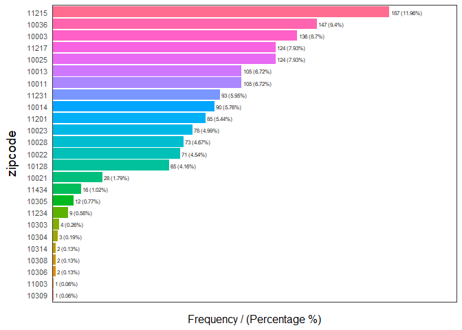<!-- -->

    ##    zipcode frequency percentage cumulative_perc
    ## 1    11215       187      11.96           11.96
    ## 2    10036       147       9.40           21.36
    ## 3    10003       136       8.70           30.06
    ## 4    10025       124       7.93           37.99
    ## 5    11217       124       7.93           45.92
    ## 6    10011       105       6.72           52.64
    ## 7    10013       105       6.72           59.36
    ## 8    11231        93       5.95           65.31
    ## 9    10014        90       5.76           71.07
    ## 10   11201        85       5.44           76.51
    ## 11   10023        78       4.99           81.50
    ## 12   10028        73       4.67           86.17
    ## 13   10022        71       4.54           90.71
    ## 14   10128        65       4.16           94.87
    ## 15   10021        28       1.79           96.66
    ## 16   11434        16       1.02           97.68
    ## 17   10305        12       0.77           98.45
    ## 18   11234         9       0.58           99.03
    ## 19   10303         4       0.26           99.29
    ## 20   10304         3       0.19           99.48
    ## 21   10306         2       0.13           99.61
    ## 22   10308         2       0.13           99.74
    ## 23   10314         2       0.13           99.87
    ## 24   10309         1       0.06           99.93
    ## 25   11003         1       0.06          100.00

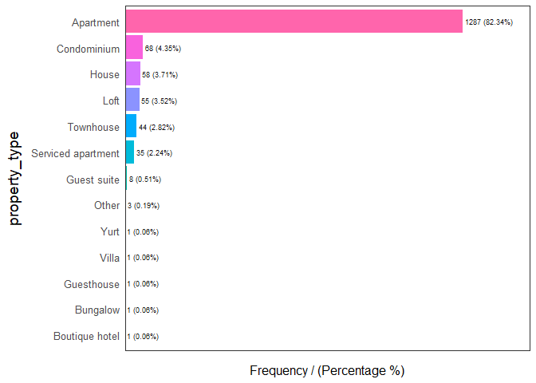<!-- -->

    ##         property_type frequency percentage cumulative_perc
    ## 1           Apartment      1287      82.34           82.34
    ## 2         Condominium        68       4.35           86.69
    ## 3               House        58       3.71           90.40
    ## 4                Loft        55       3.52           93.92
    ## 5           Townhouse        44       2.82           96.74
    ## 6  Serviced apartment        35       2.24           98.98
    ## 7         Guest suite         8       0.51           99.49
    ## 8               Other         3       0.19           99.68
    ## 9      Boutique hotel         1       0.06           99.74
    ## 10           Bungalow         1       0.06           99.80
    ## 11         Guesthouse         1       0.06           99.86
    ## 12              Villa         1       0.06           99.92
    ## 13               Yurt         1       0.06          100.00

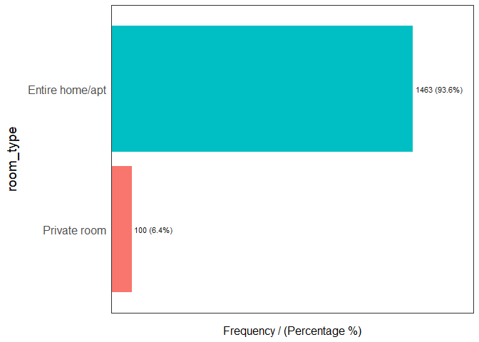<!-- -->

    ##         room_type frequency percentage cumulative_perc
    ## 1 Entire home/apt      1463       93.6            93.6
    ## 2    Private room       100        6.4           100.0

<!-- -->

    ##   bathrooms frequency percentage cumulative_perc
    ## 1         1      1054      67.43           67.43
    ## 2         2       365      23.35           90.78
    ## 3       1.5       109       6.97           97.75
    ## 4       2.5        27       1.73           99.48
    ## 5         3         3       0.19           99.67
    ## 6      <NA>         3       0.19           99.86
    ## 7         0         1       0.06           99.92
    ## 8       3.5         1       0.06          100.00

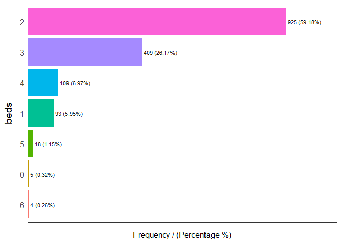<!-- -->

    ##   beds frequency percentage cumulative_perc
    ## 1    2       925      59.18           59.18
    ## 2    3       409      26.17           85.35
    ## 3    4       109       6.97           92.32
    ## 4    1        93       5.95           98.27
    ## 5    5        18       1.15           99.42
    ## 6    0         5       0.32           99.74
    ## 7    6         4       0.26          100.00

    ## [1] "Variables processed: zipcode, property_type, room_type, bathrooms, beds"

  - Based on the tables and plots above following can be stated:
      - zip codes 11215, 10036, and 10003 contain approximately
        one-third of the properties listed in the data set.
      - Apartment is the most available property type.
      - Listed properties have number of bathrooms ranging from 0 to
        3.5; however, 1 bathroom is most common.
      - Listed properties have number of beds ranging from 0 to 6;
        however, 2 beds are most common.

 

**Customized Histogram Function:**

``` r
hist_plot = function(dataset,cname,variable, width){
                  ggplot(data=dataset, aes(x=cname)) + geom_histogram(aes(y=..density..), 
                  color="darkblue", fill="lightblue", binwidth = width) + 
                  geom_vline(xintercept = median(cname, na.rm = T), 
                             color = 'Red', linetype = "dashed") +
                  geom_vline(xintercept = mean(cname, na.rm = T), color = 'Black', 
                             linetype = "dashed")+ 
                  scale_y_continuous(name= "Frequency", labels = scales::comma) +
                  scale_x_continuous(name= variable, labels = scales::comma) +
                  ggtitle(paste("Histogram of", variable )) + 
                  labs(caption = "Black dotted  line: Mean   |    Red dotted line: Median") +
                  geom_density()
}
```

The above histogram function takes in data set, column name, variable
name, and binwidth as input.

**Histogram Plots**

``` r
hist_plot(main_data1, main_data1$price,"Price", 30)
```

<!-- -->

``` r
hist_plot(main_data1, main_data1$cleaning_fee,"Cleaning Fee", 20)
```

<!-- -->

``` r
hist_plot(main_data1, main_data1$review_scores_rating,"Ratings", 1)
```

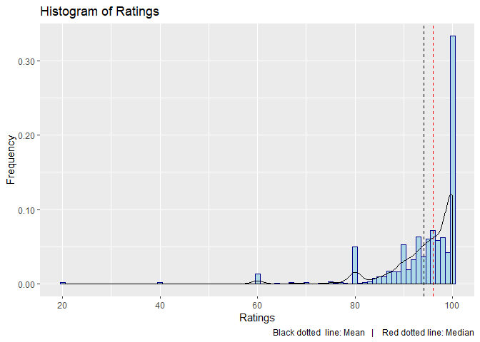<!-- -->

``` r
hist_plot(main_data1, main_data1$reviews_per_month,"Reviews per month", 0.2)
```

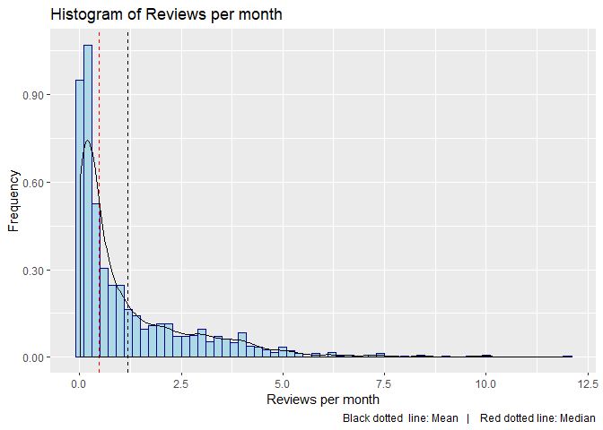<!-- -->

``` r
hist_plot(main_data1, main_data1$beds,"Number of beds", 0.5)
```

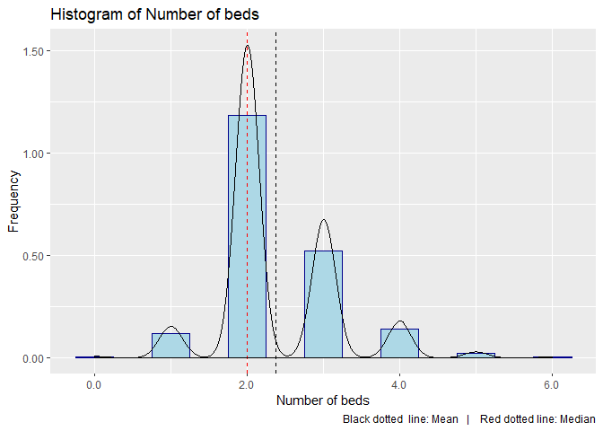<!-- -->

``` r
hist_plot(main_data1, main_data1$bathrooms,"Number of bathrooms", 0.5)
```

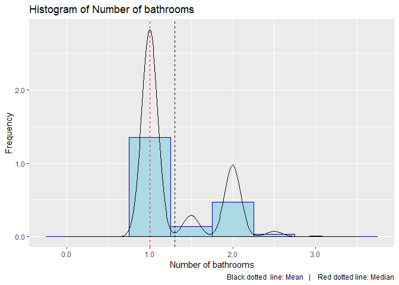<!-- -->

``` r
hist_plot(main_data1, main_data1$`2017-06`,"Median Price in Area", 100000)
```

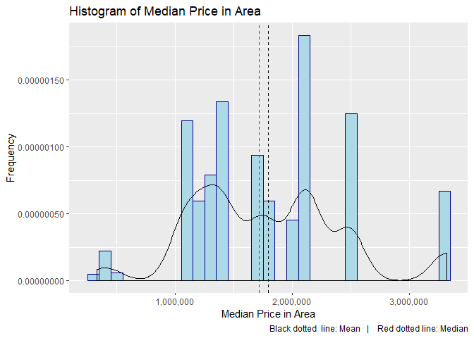<!-- -->

**Key Observations so far:**

  - Variables square\_feet, monthly\_price, and weekly\_price cannot be
    used as they contain too many NA values.
  - NA values in variables cleaning\_fee, bathrooms,
    review\_score\_ratings, and reviews\_per\_month can be imputed for
    further analyses.
  - Variable price is the charge per night whereas the variable
    ‘2017-06’ i.e. property cost is the median cost. This must be
    kept in mind at the time of calculations.
  - Right skewed variables = (Price, cleaning\_fee, reviews\_per\_month,
    beds, bathrooms, 2017-06)
  - Left skewed variables = (review\_scores\_ratings)

*Outlier treatment has been skipped, as it is not required in the case
at hand. Removing outliers in this case might lead to loosing some
important observations. e.g. a property that has a very high annual
revenue can be an outlier, but we cannot remove it.*

<a href="#top">Back to top</a>

### Data Munging

**Imputation of NA values:**

``` r
#for review score rating
main_data1$review_scores_rating[is.na(main_data1$review_scores_rating)] = median(main_data1$review_scores_rating, na.rm =TRUE)  

#for review per month
main_data1$reviews_per_month[is.na(main_data1$reviews_per_month)] = median(main_data1$reviews_per_month, na.rm =TRUE)  

#for bathrooms
main_data1$bathrooms[is.na(main_data1$bathrooms)] = median(main_data1$bathrooms, na.rm =TRUE)  

#for cleaning fee; as sometimes it's included in the price
main_data1$cleaning_fee[is.na(main_data1$cleaning_fee)] = 0  

#Cross-check of missing values
sum(is.na(main_data1$review_scores_rating))
```

    ## [1] 0

``` r
sum(is.na(main_data1$reviews_per_month))
```

    ## [1] 0

``` r
sum(is.na(main_data1$bathrooms))
```

    ## [1] 0

``` r
sum(is.na(main_data1$cleaning_fee))
```

    ## [1] 0

  - As variables review\_score\_rating, review\_per\_month, and
    bathrooms have skewed distributions, NA values have been imputed
    with the corresponding median values.
  - In variable cleaning\_fee NA values have been replaced by 0, as in
    most of the cases cleaning fee is included in the rent of the
    property.

 

#### Cleaning fee recovered as revenue:

  - Usually, the cleaning fee charged by the host is not completely
    spent in cleaning the property. Some percentage of it gets converted
    as revenue. As a matter of fact, hosts charge a slightly high
    cleaning fee in order to be on the safer side. However, the amount
    that is utilized as the cleaning fee varies from property to
    property.
  - In the available data, in order to take account of this variation,
    I’ve considered that the cleaning fee varies on the basis of size
    of the property(sq\_feet), number of bathrooms(bathrooms), and
    number of beds(beds) in the property. But, I can only use beds and
    bathrooms variables as sq\_feet variable has too many NA values.
  - Now, since, we are dealing with only 2 bedroom properties, we can
    use this as a fixed measure and categorize the cleaning fee.
  - Properties having more than 2 bathrooms or having more than 4 beds
    will be categorized as ‘high cleaning fee’ properties and remaining
    as ‘low cleaning fee’ properties.
  - **(Assumption)** ‘High cleaning fee’ properties recover 15 percent
    of the charged cleaning fee as revenue and ‘Low cleaning fee’
    properties recover 30 percent of the charged cleaning fee.

 

**New variable containing cleaning fee categories:**

``` r
#new column for category wise cleaning fee 
main_data1$cf_cat = ifelse(main_data1$beds>=4 | main_data1$bathrooms > 2, 0.15, 0.3)

table(main_data1$cf_cat) # checking the fequency of categories
```

    ## 
    ## 0.15  0.3 
    ##  162 1401

  - A new column ‘cf\_cat’ has been created for cleaning fee categories
    to be used in further calculations.
  - Aprroximately 90 percent of the data has been categorized as low
    cleaning fee property.

 

**Revenue per annum:** Annual revenue will be calculated considering 75%
occupancy and percentage of cleaning fee recovered as revenue(explained
above).

``` r
main_data1$revenue_perannum = (main_data1$price*365*0.75) + (main_data1$cleaning_fee*main_data1$cf_cat*365*0.75)

summary(main_data1$revenue_perannum)
```

    ##    Min. 1st Qu.  Median    Mean 3rd Qu.    Max. 
    ##   13688   51328   69806   85252   97181 1098285

A new variable ‘revenue\_perannum’ was created containing annual revenue
of individual properties.

 

**Return on investment:** ROI calculation using revenue\_perannum and
cost of individual properties.

``` r
main_data1$roi = main_data1$revenue_perannum/main_data1$`2017-06`*100

#rounding to 0 decimal place
main_data1$roi = round(main_data1$roi,2)

summary(main_data1$roi)
```

    ##    Min. 1st Qu.  Median    Mean 3rd Qu.    Max. 
    ##   0.680   3.190   4.270   5.076   5.890  84.330

*Latest available median price within the zip code, i.e. ‘2017-06’
variable has been assumed as cost of individual properties.*

<a href="#top">Back to top</a>

### Visual Data Narrative

**Quadrant Analysis plot to filter most profitable properties:**

``` r
#plot
q_p = main_data1 %>%
mutate(text = paste("Zipcode: ", main_data1$zipcode,"\nNeighborhood :",
                    main_data1$neighbourhood_cleansed, "\nMedian property cost: ",
                    main_data1$`2017-06`, "\nRevenue: ", main_data1$revenue_perannum,
                    "\nROI: ", main_data1$roi, "\nID: ", main_data1$id, sep="")) %>%
  
ggplot( aes(x=revenue_perannum, y=roi, color = zipcode, text=text)) +
  geom_point(alpha=0.7) + geom_hline(yintercept = median(main_data1$roi))+
  geom_vline(xintercept = median(main_data1$revenue_perannum))+
  scale_size(range = c(1.4, 19)) + scale_color_viridis(discrete=TRUE, guide=FALSE) +
  theme_ipsum()+ ggtitle("Quadrant Analysis: Revenue vs ROI") + 
  ylab("Return on investment") +
  scale_x_continuous(name="Revenue per annum", labels = scales::comma)

qp = ggplotly(q_p, tooltip="text")
qp
```

<!-- -->

##### About the above plot:

  - Scatter plot of Revenue per annum vs Return on investment for all
    properties
  - The whole plot has been divided into four quadrants by lines of
    respective median values of axis parameters
  - Tool-tip has details about the zip code, neighbourhood, Median
    property cost, revenue, ROI, and Property ID.(Please, hover over the
    scatter points)
  - Scatter points have been color coded based on zip codes
  - A section of the plot can be selected in order to further zoom-in
  - Multiple data points can be visualized and compared after selecting
    the “compare data on hover” feature on the top right corner of the
    plot
  - zip codes in the legend can be selected for a detailed analysis of a
    particular zip code.

 

##### **Quadrant Analysis:**

  - In order to ensure profitability, both revenue generated per annum
    and ROI are important.
  - A property having high revenue per annum won’t be a great investment
    if its ROI is low.
  - In order to ensure that the real estate company end up with a
    property that has a good revenue as well as having a comparatively
    good ROI than most of the properties, Quadrant Analysis has been
    performed.
  - (Key Observation) From the above plot, the properties having higher
    annual revenue and higher ROI than 50% of the available properties
    lie in the top right quadrant.

 

**Filtering based on Quadrant analysis:**

``` r
#filtering the bottom right quadrant data
final_data = subset(main_data1, roi > median(roi) & revenue_perannum > median(revenue_perannum))

dim(main_data1)
```

    ## [1] 1563   27

``` r
dim(final_data)
```

    ## [1] 552  27

``` r
# frequency of zip codes
freq(data = final_data, input = c('zipcode'))
```

<!-- -->

<div data-pagedtable="false">

<script data-pagedtable-source type="application/json">
{"columns":[{"label":["zipcode"],"name":[1],"type":["chr"],"align":["left"]},{"label":["frequency"],"name":[2],"type":["int"],"align":["right"]},{"label":["percentage"],"name":[3],"type":["dbl"],"align":["right"]},{"label":["cumulative_perc"],"name":[4],"type":["dbl"],"align":["right"]}],"data":[{"1":"10036","2":"95","3":"17.21","4":"17.21"},{"1":"10025","2":"60","3":"10.87","4":"28.08"},{"1":"10011","2":"45","3":"8.15","4":"36.23"},{"1":"11201","2":"42","3":"7.61","4":"43.84"},{"1":"11217","2":"42","3":"7.61","4":"51.45"},{"1":"10022","2":"36","3":"6.52","4":"57.97"},{"1":"10003","2":"35","3":"6.34","4":"64.31"},{"1":"10023","2":"32","3":"5.80","4":"70.11"},{"1":"11215","2":"30","3":"5.43","4":"75.54"},{"1":"10013","2":"28","3":"5.07","4":"80.61"},{"1":"10014","2":"28","3":"5.07","4":"85.68"},{"1":"11231","2":"26","3":"4.71","4":"90.39"},{"1":"10028","2":"22","3":"3.99","4":"94.38"},{"1":"10128","2":"21","3":"3.80","4":"98.18"},{"1":"10021","2":"9","3":"1.63","4":"99.81"},{"1":"10305","2":"1","3":"0.18","4":"100.00"}],"options":{"columns":{"min":{},"max":[10]},"rows":{"min":[10],"max":[10]},"pages":{}}}
  </script>

</div>

  - After the filter, we have 552 properties left that are comparatively
    more profitable.
  - zip codes 10036, 10025, and 10011 contains more than one-third of
    the filtered properties.
  - zip code 10305 has only one property that got filtered.
  - Now, there are only 16 zip codes left for further analysis.

 

**Further analysis:**

``` r
#grouping by zipcode, and ordering by Median revenue

#median review per month variable included as a measurement for popularity

by_zip1 = final_data %>% group_by(zipcode)

final_group = by_zip1 %>% summarise(Median_ROI = median(roi), 
                                    Median_rpm= median(reviews_per_month), 
                                    Median_revenue = median(revenue_perannum))

final_group2 = final_group[order(-final_group$Median_ROI, 
                                 -final_group$Median_rpm, 
                                 -final_group$Median_revenue),]

final_group2
```

<div data-pagedtable="false">

<script data-pagedtable-source type="application/json">
{"columns":[{"label":["zipcode"],"name":[1],"type":["fctr"],"align":["left"]},{"label":["Median_ROI"],"name":[2],"type":["dbl"],"align":["right"]},{"label":["Median_rpm"],"name":[3],"type":["dbl"],"align":["right"]},{"label":["Median_revenue"],"name":[4],"type":["dbl"],"align":["right"]}],"data":[{"1":"10305","2":"19.320","3":"0.48","4":"82125.00"},{"1":"11215","2":"7.670","3":"0.52","4":"82125.00"},{"1":"10025","2":"6.975","3":"0.48","4":"99850.31"},{"1":"10036","2":"6.790","3":"0.48","4":"116343.75"},{"1":"10003","2":"6.660","3":"0.48","4":"143034.38"},{"1":"11231","2":"6.555","3":"0.48","4":"78840.00"},{"1":"11217","2":"6.410","3":"0.48","4":"83493.75"},{"1":"11201","2":"6.125","3":"0.48","4":"87011.44"},{"1":"10014","2":"5.880","3":"0.48","4":"146593.12"},{"1":"10011","2":"5.680","3":"0.49","4":"140981.25"},{"1":"10013","2":"5.675","3":"0.48","4":"188203.12"},{"1":"10022","2":"5.590","3":"0.48","4":"113606.25"},{"1":"10028","2":"5.285","3":"0.48","4":"110184.38"},{"1":"10021","2":"5.200","3":"0.48","4":"94443.75"},{"1":"10023","2":"4.995","3":"0.48","4":"107036.25"},{"1":"10128","2":"4.890","3":"0.48","4":"87326.25"}],"options":{"columns":{"min":{},"max":[10]},"rows":{"min":[10],"max":[10]},"pages":{}}}
  </script>

</div>

  - The table above has been grouped on zipcode.
  - review\_per\_month has been considered as a measure of popularity;
    higher number of reviews to some extent corresponds to relatively
    higher number of bookings.
  - Above table has been ordered first on the basis of descending ROI
    then on descending reviews\_per\_month and lastly on annual revenue.

 

#### zip codes selection on the basis of the above table:

  - Order of priority of variables for profitability considered as,
    Return on investment\> Popularity(reviews\_per\_month)\> Annual
    Revenue
  - zip code 10305 appears to have the highest ROI among the filtered.
    However, it can be observed from the frequency table, only one
    property is left after quadrant analysis filtering. This zip code
    cannot be selected because of the aforementioned reason.
  - From the above table, top 5 zip codes excluding 10305 has been
    selected as the most profitable ones for Short term rentals of 2
    bedroom properties in New York.

**Selected zip codes = (11215, 10025, 10036, 10003, and 11231)**

 

**Neighbourhood Analysis:**

Drill down of selected zip codes to analyse the neighbourhoods

``` r
#subsetting the selected zip codes
data_nbr = final_data[final_data$zipcode %in% c("11215", "10025", "10036", "10003", "11231"),]

#frequency plot
freq(data = data_nbr, input = c("zipcode","neighbourhood_group_cleansed",
                                "neighbourhood_cleansed"))
```

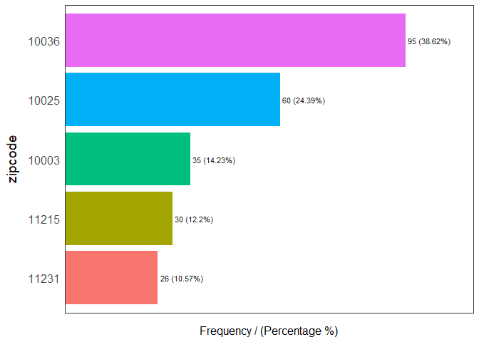<!-- -->

    ##   zipcode frequency percentage cumulative_perc
    ## 1   10036        95      38.62           38.62
    ## 2   10025        60      24.39           63.01
    ## 3   10003        35      14.23           77.24
    ## 4   11215        30      12.20           89.44
    ## 5   11231        26      10.57          100.00

<!-- -->

    ##   neighbourhood_group_cleansed frequency percentage cumulative_perc
    ## 1                    Manhattan       190      77.24           77.24
    ## 2                     Brooklyn        56      22.76          100.00

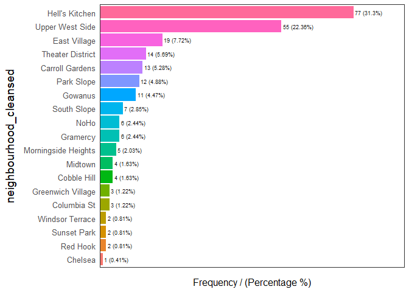<!-- -->

    ##    neighbourhood_cleansed frequency percentage cumulative_perc
    ## 1          Hell's Kitchen        77      31.30           31.30
    ## 2         Upper West Side        55      22.36           53.66
    ## 3            East Village        19       7.72           61.38
    ## 4        Theater District        14       5.69           67.07
    ## 5         Carroll Gardens        13       5.28           72.35
    ## 6              Park Slope        12       4.88           77.23
    ## 7                 Gowanus        11       4.47           81.70
    ## 8             South Slope         7       2.85           84.55
    ## 9                Gramercy         6       2.44           86.99
    ## 10                   NoHo         6       2.44           89.43
    ## 11    Morningside Heights         5       2.03           91.46
    ## 12            Cobble Hill         4       1.63           93.09
    ## 13                Midtown         4       1.63           94.72
    ## 14            Columbia St         3       1.22           95.94
    ## 15      Greenwich Village         3       1.22           97.16
    ## 16               Red Hook         2       0.81           97.97
    ## 17            Sunset Park         2       0.81           98.78
    ## 18        Windsor Terrace         2       0.81           99.59
    ## 19                Chelsea         1       0.41          100.00

    ## [1] "Variables processed: zipcode, neighbourhood_group_cleansed, neighbourhood_cleansed"

  - 10036 has the most number of properties that have been filtered for
    being most profitable.
  - Manhattan and Brooklyn are the most profitable boroughs in New York.
    With Manhattan having most of the total filtered properties.
  - Neighbourhood wise, Hell’s Kitchen and Upper West side contains more
    than half of the profitable properties(\~54%).

**Jitter Plot: ROI in Neighbourhoods**

``` r
#Jitter plot
J_P = ggplot(data_nbr,aes(x=zipcode, y=roi, colour=neighbourhood_cleansed)) +
      geom_jitter(aes(text = paste("\nID: ", data_nbr$id, "\nMedian property cost: ",
                               data_nbr$`2017-06`, "\nRevenue: ", data_nbr$revenue_perannum,
                               "\nReviews/month: ", data_nbr$reviews_per_month,
                               sep="")), width=0.25, alpha=0.8,)+
      labs(title = "ROI in Neighbourhoods", x = "Zipcode", y = "Return on Investment") + 
      stat_summary(fun.y=median, geom="point", shape=18, size=1, color="Black")

JP = ggplotly(J_P)
JP
```

<!-- -->

About the above plot:

  - Jitter plot of zip codes vs Return on investment for all properties
  - Black diamond represents median ROI in that zip code
  - Tool-tip has details about the Property ID, Median property cost,
    Annual revenue, zip code, ROI, Neighbourhood, and Reviews per
    month.(Please, hover over the Jitter points)
  - Jitter points have been color coded based on neighbourhoods
  - A section of the plot can be selected in order to further zoom-in
  - Multiple data points can be visualized and compared after selecting
    the “compare data on hover” feature on the top right corner of the
    plot
  - Neighbourhoods in the legend can be selected for a detailed analysis
    of a particular zip code.

**The Jitter plot provides great visualization for neighbourhood
analysis under zip codes up to property ID level. Insights from the
Jitter plot:**

  - It can be deduced from the plot that property with ID 2281142 in
    East Village under the zip code 10003 has the maximum ROI.
  - Upper West Side under 10025 too has some properties having ROI more
    than 25%.
  - zip code 11215 is the most popular(based on the assumption of more
    reviews per month) among selected zip codes, comparatively ROI wise
    nothing extraordinary can be observed in the plot.

There is always a trade-off when it comes to investment, the real estate
company can use the above jitter plot when deciding on buying a
property.

**Mapping Properties**

``` r
#map
mbox = make_bbox(lon = main_data1$longitude, lat = main_data1$latitude, f = 0.01)

sz_map = get_map(location = mbox, maptype = "watercolor", source = "google")

ggmap(sz_map) + geom_point(data = data_nbr, mapping = aes(x = data_nbr$longitude, 
                            y = data_nbr$latitude), color = data_nbr$zipcode, size = 1, 
                            alpha = 0.8) + 
                xlab("longitude") + 
                ylab("latitude") +
                ggtitle("Map-view of selected zipcodes")
```

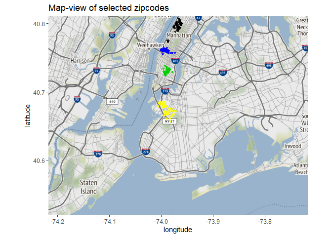<!-- -->

Map of New York containing the properties under selected zip codes.

<a href="#top">Back to top</a>

### Conclusion

#### Summary:

  - Based on all the analyses performed above, it is recommended the
    real estate company to invest in properties under the zip codes
    11215, 10025, 10036, 10003, and 11231.
  - The selection was done considering Return on Investment, Annual
    Revenue, and Popularity, with ROI as the top priority parameter.
  - Manhattan has been found to be the most profitable borough having
    the majority of the filtered properties.
  - The Jitter plot in the report can be of great help when deciding
    which neighbourhood to invest in.

 

#### What’s Next:

  - I would impute the 50 missing zip code observations mentioned
    earlier in the report using reverse geocoding in order to retain
    crucial data. This data might have changed the conclusion of the
    report, though not by much.
  - If the number of bookings data for individual properties is
    collected, the assumption of 75% occupancy can be taken out
    resulting in better cost calculations. Also, can be used in the
    analysis to get the popularity of the properties which is one of the
    key factors when deciding profitability. Also, could be used to find
    out what kind of property gets booked the most, e.g, what do people
    prefer, a loft or a villa.
  - As the zillow data set has median cost only up to June’17, I would
    try to get the latest available data and then do the analysis.
  - Cleaning fee analysis can be taken further by studying the
    “amenities” variable, keywords like “kitchen”, “extra pillows and
    blankets”, etc can be fetched out and then categorized under high
    cleaning fee properties. Similarly, other keywords like “saops”,
    “towels”, etc can be fetched out to add these as expenses in
    revenue calculation.
  - If the real estate company is planning to aquire these particular
    properties listed in the airbnb data set, “availability\_365”
    variable can be used to assess the property-wise profitability.

<a href="#top">Back to top</a>
